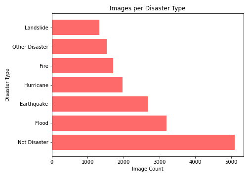
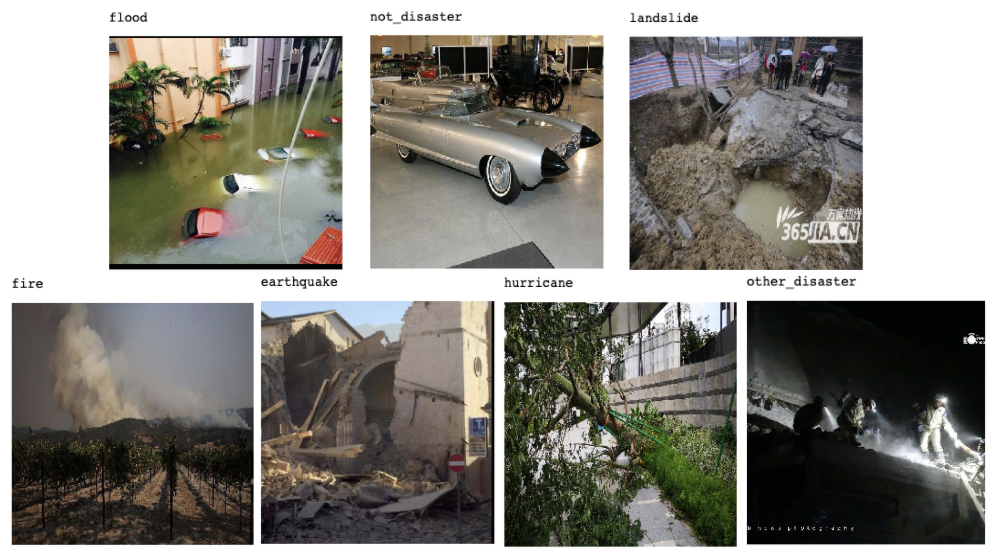

# Natrual Disaster Image Classification

**Author:** Ryan Reilly


## Overview

This project analyzes almost 17,000 images related to natural disasters.  Human labelers labeled these images and then the images were into a downloadable format from the Crisis NLP website. Crisis NLP makes resources available to help researchers and technologists  advance research on humanitarian and crisis computing. I will be using the disaster type dataset. There were two original datasets that were collected for disaster types images:

1. Damage Multimodel Dataset (DMD). Method used to collect: crawled images from Google and Instagram based on 100 different hashtags related to crisis lexicon.

2. AIDR Disaster Type Dataset (AIDR-DT) Method used to collect: tweets were collected from 17 disaster events, and then using the annotations of the tweet, they crawled images from bing, google and flickr.  

The goal of this analysis is to build a model that will accurately predict the disaster type of the image scraped off the internet. This will be done through exploratory data analysis and iterative predictive modeling using classification models. 

## Business Problem

During a disaster event, images shared on social media helps government organizations gain situational awareness and assess incurred damages, among other response tasks. By classifying images of natural disasters, this model would aim to help organizations like FEMA augment data they are already receiving about a disaster. This would allow FEMA to disseminate more information down to crisis managers so the correct resources are deployed to the disater quicker, thus saving more lives. 

## Data Understanding

The data comes in two types of files. There is a folder of images and 3 tsv files that shows the path of each image for the train, validation, and test splits. The data was downloaded from this website: https://crisisnlp.qcri.org/crisis-image-datasets-asonam20. Below are the columns and their description of each tsv file. 

| Feature | Description|
|:-------| :-------|
|event_name| Name of original dataset used. Either AIDR or DMD|
|image_id| Unique ID for each image|
|image_path| Folder structure path of where the image is stored|
|class_label|Disaster type|

### Methods

* Preliminary exploratory data analysis to identify the distribution of images across the disaster type classes, the outcome we are trying to predict
* Preprocessing images by rescaling and and passing in data augmentation parameters to be used for modeling
* Building and evaluating model performance for a baseline CNN model
* Moving to the cloud to take advantage of accelerated hardware used for transfer learning CNN models built on pre-trained CNN architectures. 
* Selecting final model and creating an app that will predict the disaster type based on an image scraped from Twitter

### Exploratory Data Analysis


The chart above shows the count of images for each of the classes. There looks to be a good amount of training images for all 7 classes. However, there does look to be a class imbalance, especially with the Not Disaster images having considerably more images. I will deal with this by experimenting with adding weights to the CNN models I train.


I created the above charts just to visually inspect the images counts across each folder. The train, validation and test folders look to have the same distribution of images over each class. The train/validation/test splits for these images are 70/10/20 respectively.



Above you can see a sample image for each class from the train folder after it has been re-scaled. All the images came in a lot of different sizes but it is important to rescale to the same range between 0 and 1 because it will make images easier to work with during the modeling process. You can see there is a lot of noise in these images, which will make it even harder to train on, so I may need to take advantage of transfer learning. 

### Model Creation and Evaluation

After preprocessing the images, I performed a baseline CNN model. Below is the confusion matirx output for the first model. This model did not do well. It basically predicted all to the majority class, not_disaster. With an accuracy score of 34, that is better than a random guess, but I think the model can be improved a lot. 


Next, I iterated on the baseline model by tweaking paramters. In this model,I added dropout layers to reduce overfitting, decreased learning rate from .001 to .0001, and added class weights to account for imbalanced classes. As you can see by the confusion matrix below, this model did not do any better, with an accuracy of 31%. 


### Moveing to the could and transfer learning

At this point I did not want to run any more models on my machine because they were taking too long to train. I decided to get a Google Colab Pro account which aloud me to access cloud GPUs with 32GB of ram compared to the 8GB of ram on my computer. The below three models were run with Colab and saved in the "transfer_learning_models" folder in the repo if you wan to see the code behind them. 

VGG16


ResNet50


Final Model - DenseNet121


### Model Comparison

| Model | Testing Accuracy|
|:-------| :-------|
|Baseline CNN| 34%|
|Baseline CNN - Tuned| 31%|
|Resnet50| 46%|
|VGG16| 56%|
|Final Model - DenseNet121| 72%|

### Web Application

The below link will take you to a web application I built using Streamlit and deployed on Heroku. It is a simple app to upload a picture and it will classify the natural disaster type.

https://nd-prediction.herokuapp.com/

### Conclusions

**Transfer learning performs better.** By using models that have been pre trained on millions of images, it not only speeds up the compute time, but accuracy improves considerably over a baseline CNN model built from scratch. 

**Consider using the final model in real applications** I showed in the demonstration that this model coulsd be used to predict images that are scraped from twitter by users who upload phots of natural disasters as they happen so FEMA can augment data they are receiving about the disaster. 

**Consider other use cases**This model would work well with other forms of social media, not just twitter, like I showed. Any place where users are uploading photos of disasters is a good place to classify the image to get more information. 

### Next Steps

**Incorporate real time image scraping** While I can upload an image manually, it would be nice to autamate the app to scrape twitter at various intervals throughout the day and automatically detect natrual disasters quicker. 

**Perform more tasks on the images** This can be done by classifying images as informative/not informative, and classify severity as severe, mild, or little to none.

**Implement other cloud based modeling** I would like to run these models using even more GPUs on other cloud providers to see if I can speed up training on the larger models.

**Gather more images** There were a good amount of images for this project, but it would be nice to get even more unique images. Natural disasters happen every year, so it would be nice to update the model with pictures of more recent natural disasters.  

### For More Information:
Please review my full analysis in the [Final Notebook](./final_notebook.ipynb), [Transfer Learning Notebooks](./transfer_learning_notebooks.ipynb), [Images](./images), or the [Presentation](./final_presentation.pdf)

For any additional questions, please contact me:

Ryan Reilly: 
Email: ryan.m.reilly@gmail.com
Github: https://github.com/ryanreilly
Linkedin: https://www.linkedin.com/in/ryanreilly1/


### Repo Structure
```
├── data
│   ├── consolidated_disaster_types_dev_final.tsv
│   ├── consolidated_disaster_types_test_final.tsv
│   └──  consolidated_disaster_types_train_final.tsv
│
├── images
│   ├── disaster_1.jpeg
│   ├── classes_count.png
│   ├── distribution_splits.png
│   ├── sample_images.png
│   ├── FSM_confusion.png
│   ├── FSM_training_loss.png
│   ├── FSM_training_classification_report.png
│   ├── 2ndModel_confusion.png
│   ├── 2ndModel_training_loss.png
│   ├── 2ndModel_training_classification_report.png
│   ├── vgg_confusion.png
│   ├── vgg_training_loss.png
│   ├── vgg_training_classification_report.png
│   ├── resnet_confusion.png
│   ├── resnet_training_loss.png
│   ├── resnet_training_classification_report.png
│   ├── dense_confusion.png
│   ├── dense_training_loss.png
│   └──  dense_training_classification_report.png
|
├── src
│   └── preprocessing.py
|
├── working_notebooks
│   ├── ryan_working_notebook.ipynb
│   ├── image_divider.ipynb
│   └── twitter_scraping.ipynb
│
├── transfer_learning_notebooks
│   ├── DenseNet121_model.ipynb
│   ├── ResNet50_model.ipynb
│   └── VGG16_model.ipynb
|
├── .gitignore
├── CONTRIBUTING.md
├── LICENSE.md
├── README.md
├── final_notebook.ipynb
├── final_presentation.pdf
└── 
```


